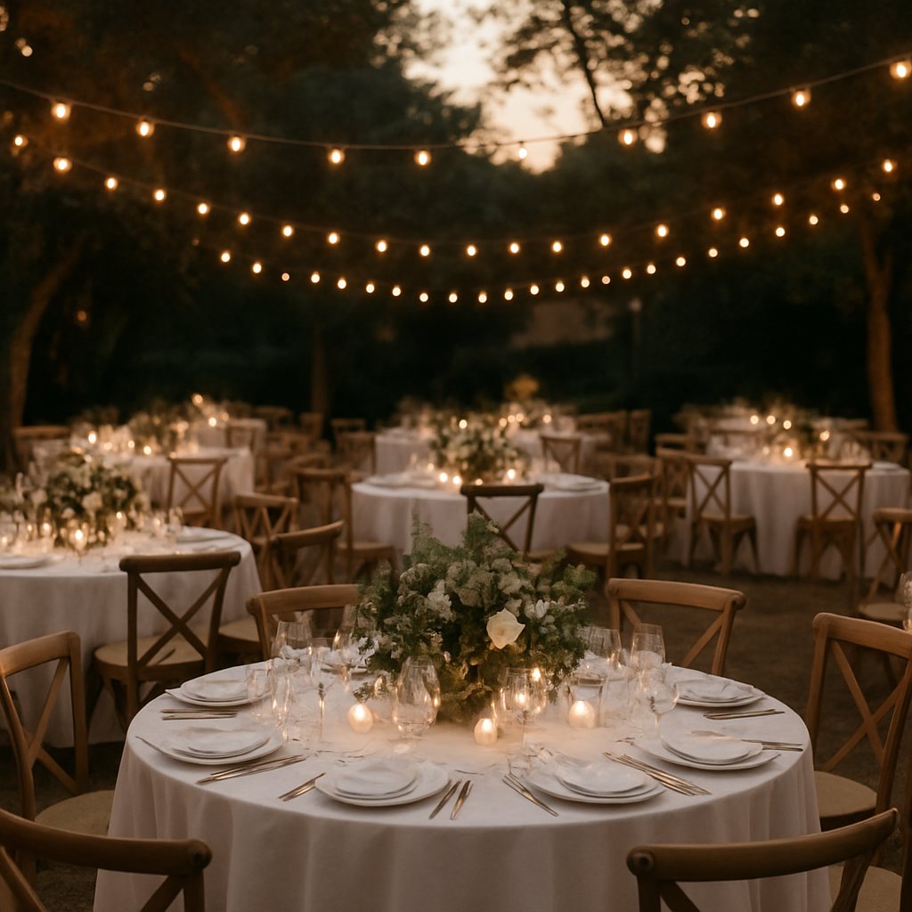

# Nuptia — Estudio de Bodas

<p align="center">
  
</p>

<p align="center">
  <strong>La manera más elegante de organizar vuestra boda.</strong><br />
  Invitaciones digitales, web personalizada, gestión de invitados y galería en vivo. Todo en un único estudio, sin comisiones.
</p>

<p align="center">
  Next.js 16 · React 19 · Prisma 7 · tRPC · Tailwind CSS v4 · Better Auth
</p>

---

## ✨ Qué es Nuptia

Nuptia es una aplicación web para parejas que organizan su boda. Reemplaza el mosaico de hojas de cálculo, chats de grupo y papelería impresa por **un único panel de control** desde el que diseñar la invitación, publicar la web del evento y gestionar a los invitados de principio a fin.

La demo pública (`/`) muestra el producto con datos reales de ejemplo; la aplicación privada (`/app`) es el estudio de trabajo de la pareja.

## 🧩 Módulos principales

| Módulo | Qué resuelve |
| --- | --- |
| **Dashboard** | Cuenta atrás en vivo, estadísticas de RSVP, tareas pendientes y accesos rápidos a cada módulo. |
| **Invitación digital** | Editor en tiempo real con fondos, tipografías, paletas de color, música y efectos de apertura, con previsualización en móvil. |
| **Web de bodas** | Microsite con URL propia (`nuptia.app/vuestro-slug`) donde activar solo los módulos que necesitéis: mapa, menú, itinerario, regalos o galería. |
| **Gestión de invitados** | Lista con búsqueda y filtros, seguimiento de RSVP, menús especiales, alergias y distribución de mesas con drag & drop. |

### 💌 Invitación digital

<p align="center">
  
</p>

- 3 fondos fotográficos incluidos, o vuestra propia foto.
- Tipografía clásica o moderna a elegir.
- 3 paletas de color: Salvia, Terracota, Pizarra.
- Música de fondo personalizada.
- Efectos de apertura: sobre virtual, pétalos, suave.
- Confirmación de asistencia (RSVP) integrada.

### 🌐 Web de bodas

<p align="center">
  
</p>

- Mapa y localización de ceremonia y celebración (Google Maps).
- Menú del banquete con fotos y avisos de alergias.
- Itinerario visual del día completo.
- Mesa de regalos (IBAN o enlace externo).
- Lista de Spotify colaborativa.
- Galería en vivo: los invitados suben fotos en tiempo real.

### 👥 Gestión de invitados

- Lista completa con búsqueda y filtros por estado.
- Seguimiento de RSVP: confirmados, pendientes y declinados.
- Menús especiales: carne, pescado, vegetariano, infantil.
- Distribución de mesas con drag & drop interactivo.
- Envío y reenvío de invitaciones en un clic.
- Notas y alergias por invitado.

### 📸 Galería en vivo

<p align="center">
  
  
</p>

Los invitados comparten sus fotos del gran día al instante, sin instalar nada.

## 🏗️ Arquitectura

El proyecto sigue una arquitectura por dominios (domain-driven), donde cada carpeta de `src/domains/` es independiente y expone sus propias capas:

```
src/domains/<dominio>/
├── domain/          # Entidades y reglas de negocio puras
├── application/      # Casos de uso y DTOs
├── adapters/          # Next.js: páginas, componentes, rutas de API/tRPC
└── infrastructure/    # Repositorios y acceso a datos (Prisma)
```

Dominios actuales: `weddings`, `invitations`, `guests`, `media`, `wedding-sites`.

Rutas principales de la app (`src/app/`):

- `(marketing)` — landing pública con la demo.
- `(private)/app` — estudio privado de la pareja (dashboard, invitación, web, invitados, ajustes).
- `(auth)` — flujo de autenticación.
- `w/[slug]` — microsite público de cada boda.
- `i/[token]` — invitación digital pública con RSVP.
- `api` — endpoints REST/tRPC.

## 🛠️ Stack tecnológico

- **[Next.js 16](https://nextjs.org)** (App Router) + **React 19**
- **[Prisma 7](https://www.prisma.io)** con adaptadores para SQLite (desarrollo) y MariaDB (producción)
- **[tRPC](https://trpc.io)** + **TanStack Query** para la capa de datos tipada
- **[Better Auth](https://www.better-auth.com)** para autenticación
- **[Supabase](https://supabase.com)** para almacenamiento de media
- **[Tailwind CSS v4](https://tailwindcss.com)** + **[Base UI](https://base-ui.com)** para el sistema de diseño
- **TypeScript** en modo estricto

## 🚀 Cómo arrancar

Este proyecto usa `pnpm` como gestor de paquetes.

```bash
pnpm install
pnpm dev
```

Abre [http://localhost:3000](http://localhost:3000) para ver la demo pública, y `/app` para el estudio privado.

### Scripts disponibles

| Comando | Descripción |
| --- | --- |
| `pnpm dev` | Servidor de desarrollo |
| `pnpm build` | Build de producción |
| `pnpm start` | Sirve el build de producción |
| `pnpm lint` | ESLint (reglas de Next.js + TypeScript) |
| `pnpm typecheck` | Generación de tipos de Next.js + `tsc --noEmit` |
| `pnpm db:generate` | Genera el cliente de Prisma |
| `pnpm db:migrate:sqlite` | Migraciones locales sobre SQLite |
| `pnpm db:migrate` | Migraciones con Prisma (`prisma migrate dev`) |
| `pnpm db:seed` | Siembra la base de datos con datos de ejemplo |
| `pnpm db:studio` | Abre Prisma Studio |
| `pnpm db:diagram` | Regenera el diagrama entidad-relación ([diagram.md](diagram.md)) |

## 📄 Licencia

Proyecto privado. Todos los derechos reservados.
