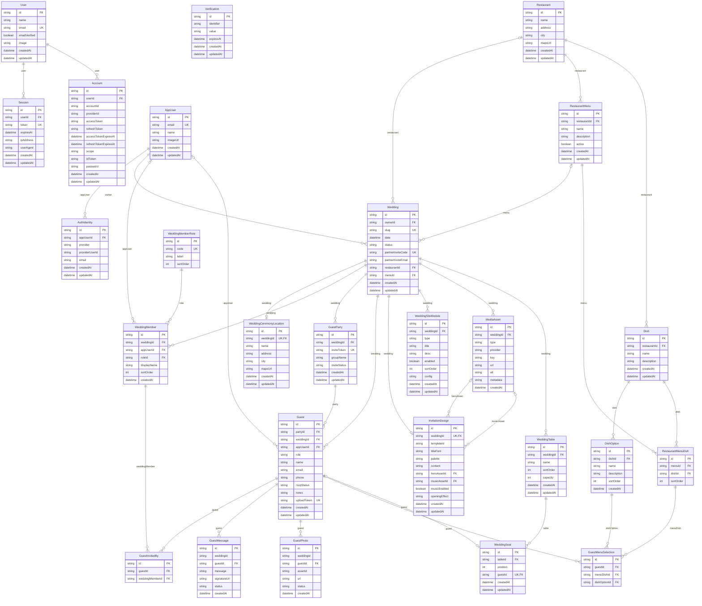

<!-- Generated by `pnpm db:diagram`. Do not edit manually. -->

```mermaid
erDiagram

    User {
        string id PK
        string name
        string email UK
        boolean emailVerified
        string image
        datetime createdAt
        datetime updatedAt
    }

    Session {
        string id PK
        string userId FK
        string token UK
        datetime expiresAt
        string ipAddress
        string userAgent
        datetime createdAt
        datetime updatedAt
    }

    Account {
        string id PK
        string userId FK
        string accountId
        string providerId
        string accessToken
        string refreshToken
        datetime accessTokenExpiresAt
        datetime refreshTokenExpiresAt
        string scope
        string idToken
        string password
        datetime createdAt
        datetime updatedAt
    }

    Verification {
        string id PK
        string identifier
        string value
        datetime expiresAt
        datetime createdAt
        datetime updatedAt
    }

    AppUser {
        string id PK
        string email UK
        string name
        string imageUrl
        datetime createdAt
        datetime updatedAt
    }

    AuthIdentity {
        string id PK
        string appUserId FK
        string provider
        string providerUserId
        string email
        datetime createdAt
        datetime updatedAt
    }

    Wedding {
        string id PK
        string ownerId FK
        string slug UK
        datetime date
        string status
        string partnerInviteCode UK
        string partnerInviteEmail
        string restaurantId FK
        string menuId FK
        datetime createdAt
        datetime updatedAt
    }

    WeddingCeremonyLocation {
        string id PK
        string weddingId UK,FK
        string name
        string address
        string city
        string mapsUrl
        datetime createdAt
        datetime updatedAt
    }

    WeddingMemberRole {
        string id PK
        string code UK
        string label
        int sortOrder
    }

    WeddingMember {
        string id PK
        string weddingId FK
        string appUserId FK
        string roleId FK
        string displayName
        int sortOrder
        datetime createdAt
    }

    GuestParty {
        string id PK
        string weddingId FK
        string inviteToken UK
        string groupName
        string inviteStatus
        datetime createdAt
        datetime updatedAt
    }

    Guest {
        string id PK
        string partyId FK
        string weddingId FK
        string appUserId FK
        string role
        string name
        string email
        string phone
        string rsvpStatus
        string notes
        string uploadToken UK
        datetime createdAt
        datetime updatedAt
    }

    GuestInvitedBy {
        string id PK
        string guestId FK
        string weddingMemberId FK
    }

    InvitationDesign {
        string id PK
        string weddingId UK,FK
        string templateId
        string titleFont
        string palette
        string content
        string heroAssetId FK
        string musicAssetId FK
        boolean musicEnabled
        string openingEffect
        datetime createdAt
        datetime updatedAt
    }

    WeddingSiteModule {
        string id PK
        string weddingId FK
        string type
        string title
        string desc
        boolean enabled
        int sortOrder
        string config
        datetime createdAt
        datetime updatedAt
    }

    MediaAsset {
        string id PK
        string weddingId FK
        string type
        string provider
        string key
        string url
        string alt
        string metadata
        datetime createdAt
    }

    GuestMessage {
        string id PK
        string weddingId
        string guestId FK
        string message
        string signatureUrl
        string status
        datetime createdAt
    }

    GuestPhoto {
        string id PK
        string weddingId
        string guestId FK
        string assetId
        string url
        string status
        datetime createdAt
    }

    Restaurant {
        string id PK
        string name
        string address
        string city
        string mapsUrl
        datetime createdAt
        datetime updatedAt
    }

    RestaurantMenu {
        string id PK
        string restaurantId FK
        string name
        string description
        boolean active
        datetime createdAt
        datetime updatedAt
    }

    Dish {
        string id PK
        string restaurantId FK
        string name
        string description
        datetime createdAt
        datetime updatedAt
    }

    DishOption {
        string id PK
        string dishId FK
        string name
        string description
        int sortOrder
        datetime createdAt
    }

    RestaurantMenuDish {
        string id PK
        string menuId FK
        string dishId FK
        int sortOrder
    }

    GuestMenuSelection {
        string id PK
        string guestId FK
        string menuDishId FK
        string dishOptionId FK
    }

    WeddingTable {
        string id PK
        string weddingId FK
        string name
        int sortOrder
        int capacity
        datetime createdAt
        datetime updatedAt
    }

    WeddingSeat {
        string id PK
        string tableId FK
        int position
        string guestId UK,FK
        datetime createdAt
        datetime updatedAt
    }

    User ||--o{ Session : "user"

    User ||--o{ Account : "user"

    AppUser ||--o{ AuthIdentity : "appUser"

    AppUser ||--o{ Wedding : "owner"

    Restaurant |o--o{ Wedding : "restaurant"

    RestaurantMenu |o--o{ Wedding : "menu"

    Wedding ||--o| WeddingCeremonyLocation : "wedding"

    Wedding ||--o{ WeddingMember : "wedding"

    AppUser |o--o{ WeddingMember : "appUser"

    WeddingMemberRole ||--o{ WeddingMember : "role"

    Wedding ||--o{ GuestParty : "wedding"

    GuestParty ||--o{ Guest : "party"

    Wedding ||--o{ Guest : "wedding"

    AppUser |o--o{ Guest : "appUser"

    Guest ||--o{ GuestInvitedBy : "guest"

    WeddingMember ||--o{ GuestInvitedBy : "weddingMember"

    Wedding ||--o| InvitationDesign : "wedding"

    MediaAsset |o--o{ InvitationDesign : "heroAsset"

    MediaAsset |o--o{ InvitationDesign : "musicAsset"

    Wedding ||--o{ WeddingSiteModule : "wedding"

    Wedding ||--o{ MediaAsset : "wedding"

    Guest ||--o{ GuestMessage : "guest"

    Guest ||--o{ GuestPhoto : "guest"

    Restaurant ||--o{ RestaurantMenu : "restaurant"

    Restaurant ||--o{ Dish : "restaurant"

    Dish ||--o{ DishOption : "dish"

    RestaurantMenu ||--o{ RestaurantMenuDish : "menu"

    Dish ||--o{ RestaurantMenuDish : "dish"

    Guest ||--o{ GuestMenuSelection : "guest"

    RestaurantMenuDish ||--o{ GuestMenuSelection : "menuDish"

    DishOption ||--o{ GuestMenuSelection : "dishOption"

    Wedding ||--o{ WeddingTable : "wedding"

    WeddingTable ||--o{ WeddingSeat : "table"

    Guest |o--o| WeddingSeat : "guest"
```
